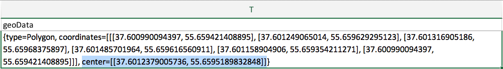

```{r setup, include=FALSE}
#-------------------------Package Installer--------------------------
# load packages and install if missing
# thanks to Richard Schwinn for the code, http://stackoverflow.com/a/33876492

# list the packages you need
p <- c("data.table", "readxl", "sf")

# this is a package loading function
loadpacks <- function(package.list = p){
new.packages <- package.list[!(package.list %in% installed.packages()[,"Package"])]
        if(length(new.packages)) {
                install.packages(new.packages, repos = "https://cran.rstudio.com")
        }
lapply(eval(package.list), require, character.only = TRUE)
}

loadpacks(p) # calling function to load and/or install packages
rm(loadpacks, p) # cleanup namespace

#----------------------End of Package Installer----------------------
```


## План лекции

- Скачиваем готовые данные

- Скачиваем данные при помощи open-source инструментов

- Обрабатываем данные вручную в Excel или LibreOffice/OpenOffice

- Обрабатываем данные в R


## Скачиваем готовые данные

[https://gitlab.com/nextgis/data.mos.ru](https://gitlab.com/nextgis/data.mos.ru)

Спаисибо Максиму Дубинину и NextGIS (не реклама!)!

Скрипт для обработки данных написан Максимом Дубининым в рамках Дня открытых данных 2017 года.


## Скачиваем данные при помощи open-source инструментов

- устанавливаем Node.js: https://nodejs.org/

- устанавливаем https://github.com/urbica/datamos-geojson

    - или просто после утановки Node.js в командной строке выполняем `npm install -g datamos-geojson`
    
- в командной строке выполняем `datamos-geojson` и вводим номер датасета с сайта data.mos.ru, указанный в паспорте

[https://data.mos.ru/opendata/7710878000-gorodskoy-wi-fi/passport?versionNumber=1&releaseNumber=6](https://data.mos.ru/opendata/7710878000-gorodskoy-wi-fi/passport?versionNumber=1&releaseNumber=6)


Спасибо Андрею Кармацкому и Urbica (не реклама)!


## Обрабатываем данные вручную в Excel или LibreOffice/OpenOffice



## Обрабатываем данные в R

Читаем документацию портала открытых данных: https://apidata.mos.ru/Docs#datasetFeatures


