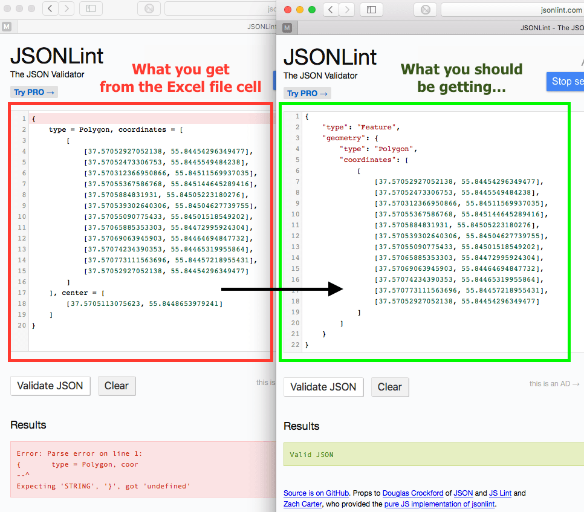

Блог пост 2017 года с деталями: [http://ekotov.blogspot.ru/2017/02/fixing-open-data-with-r-case-of-moscow.html](http://ekotov.blogspot.ru/2017/02/fixing-open-data-with-r-case-of-moscow.html)


# Установка и активация пакетов

```{r install_packages, results="hide", message=FALSE}
# first install missing packages
# thanks to Pratik Patil for the package installation code ( http://stackoverflow.com/a/29622385 )
# Specify the list of required packages to be installed and load  
Required_Packages <- c("data.table", "readxl", "sf", "parallel", "rlist", "rgdal")

Install_And_Load <- function(Required_Packages) {
        Remaining_Packages <- Required_Packages[!(Required_Packages %in% installed.packages()[,"Package"])]
        
        if(length(Remaining_Packages)) 
        {
                install.packages(Remaining_Packages, repos = "https://cran.rstudio.com", type = "binary")
        }
        for(package_name in Required_Packages)
        {
                library(package_name, character.only = T, quietly = F)
        }
}


Install_And_Load(Required_Packages) # Call the function to install packages
```


# Скачиваем данные

Вводим url ссылки:

```{r}
download_url <- "http://op.mos.ru/EHDWSREST/catalog/export/get?id=86337"
download_url <- "http://op.mos.ru/EHDWSREST/catalog/export/get?id=254700"
```

Скачиваем файл

```{r get_data, results = "hide", message = FALSE}
download.file(download_url, destfile = "data/adreg.zip", mode = "wb")
```

Распакуем архив

```{r}
unzip(zipfile = 'data/adreg.zip', exdir = "data/")
```

Если хотим, удаляем файл архива, на всякий случай строка тут закомментирована

```{r}
# unlink('data/adreg.zip')
```


# Загрузим данные в R

Список файлов в папке data

```{r}
file_list <- list.files("data/")
file_list
```

Отберем только те файлы, которые xlsx, но не zip, который у нас лежит там же (хотя могли для верности и в другую папку распаковать). И добавим имя подпапки

```{r}
file_list <- paste0("data/", file_list[ file_list %like% "xlsx"])
file_list
```

Загрузим файлы по списку

```{r}
xlsx_tables <- lapply(file_list, read_excel)
str(xlsx_tables, max.level = 1)
```


Объединим таблицы

```{r}
x <- xlsx_tables %>% list.stack(data.table = T)
str(x)
```

Удалим из памяти лишнее

```{r}
rm(xlsx_tables)
```

Взглянем на первое наблюдение

```{r}
x[ 1, geoData, ]
```

Посмотрим сколько объетов с геометрией "полигон" и "мультиполигон"

```{r}
nrow(x)
x[ geoData %like% 'type=Polygon', .N, ]
x[ geoData %like% 'type=MultiPolygon', .N, ]
x[ ! geoData %like% 'type=Polygon|type=MultiPolygon', .N]
```

Посмотрим, как выглядят эти объекты

```{r}
x[ geoData %like% 'type=Polygon', geoData, ][1]
x[ geoData %like% 'type=MultiPolygon', geoData, ][1]
x[ ! geoData %like% 'type=Polygon|type=MultiPolygon', ][1]
```

Есть еще интересные случаи, нашлись бы во время отладки кода для обработки текста...

```{r}
x[ ! (geoData %like% 'Polygon' | is.na(geoData)) , geoData, ]
```

У всех ли есть центроиды? Теперь да, год назад были записи без них. На вскякий случай лучше проверять.

```{r}
x[ geoData %like% 'type=Polygon' & ! geoData %like% 'center=', .N, ] # Polygons without centroids
x[ geoData %like% 'type=Polygon' & ! geoData %like% 'center=', .N, ] # Polygons without centroids
```

Итого

```{r}
x[ geoData %like% 'type=Polygon' & geoData %like% 'center=', .N, ] # полигонов с центроидами, штук
x[ geoData %like% 'type=MultiPolygon' & geoData %like% 'center=', .N, ] # мультиполигонов с центроидами, штук
x[ geoData %like% 'type=Polygon' & ! geoData %like% 'center=', .N, ] # полигонов без центроидов, штук
x[ geoData %like% 'type=MultiPolygon' & ! geoData %like% 'center=', .N, ] # мультиполигонов без центроидов, штук
x[ is.na(geoData) , .N, ] # объектов без геометрии
x[ ! (geoData %like% 'Polygon' | is.na(geoData)) , .N, ] # слишком длинное значение
```
 

# Обрабатываем данные

## Что не так с данными?

Открываем [http://jsonlint.com](http://jsonlint.com)

Копируем содержимое колонки с геоданными и смотрим в jsonlint и читая документацию по стандарту geojson [http://geojson.org/geojson-spec.html](http://geojson.org/geojson-spec.html) думаем, что не так с данными.



Копируем каждый из случаев и сравниваем, как есть, и как должно быть.

```{r}
x[ geoData %like% 'type=Polygon', geoData, ][1]
x[ geoData %like% 'type=MultiPolygon', geoData, ][1]
```

Ниже пример валидного geojson

```{}
{
	"type": "Feature",
	"geometry": {
		"type": "Polygon",
		"coordinates": [
			[
				[37.530676174611, 55.831478252432],
				[37.53073594909, 55.831462256528],
				[37.53074507818, 55.831473674344],
				[37.530815995964, 55.831455396081],
				[37.530832224574, 55.831472512728],
				[37.531057134726, 55.831411988342],
				[37.531069851678, 55.83142590211],
				[37.531140225561, 55.83140626578],
				[37.531009382321, 55.831250611877],
				[37.530952650774, 55.831267729847],
				[37.530948612385, 55.831290535142],
				[37.530733834545, 55.831351056795],
				[37.530735871132, 55.831363599985],
				[37.530682175477, 55.831377874395],
				[37.530692320099, 55.831392116673],
				[37.53062038674, 55.831411536679],
				[37.530676174611, 55.831478252432]
			]
		]
	}
}
```

## Как починить данные?

Идем на [https://regex101.com](https://regex101.com) или [http://www.regexr.com](http://www.regexr.com).

### RegExp для полигонов с центроидами

Регулярное выражение: `(?:{type=Polygon, coordinates=)(.*)(?:, center=.*})`

Замена: `{ "type": "Feature", "geometry": {"type": "Polygon", "coordinates": \1 }}`

### RegExp для полигонов без центроидов


Регулярное выражение: `(?:{type=MultiPolygon, coordinates=)(.*)(?:.*})`

Замена: `{ "type": "Feature", "geometry": {"type": "MultiPolygon", "coordinates": \1 }}`

## Чиним данные

Оставим только те данные, где вообще есть валидная геометрия и сделаем бэкап объектов без геометрии

```{r}
x_no_geom <- copy(x[ is.na(geoData) ])
dim(x_no_geom)
x <- x[ geoData %like% 'Polygon' ]
```


Применим разработанные регулярные выражения:

```{r apply_regexps, results='hide', message=F}
# convert Polygons with center data
x[ geoData %like% 'type=Polygon' & geoData %like% 'center=',
   geoDataJSON := paste0('{ "type": "Feature",', '"properties": { "unom": "', UNOM,
                         gsub(pattern = '(?:\\{type=Polygon, coordinates=)(.*)(?:, center=.*)(\\})',
                          replacement = '" \\}, "geometry": \\{"type": "Polygon", "coordinates": \\1 \\}\\}',
   x = geoData)), ]

# convert MultiPolygons with center data
x[ geoData %like% 'type=MultiPolygon' & geoData %like% 'center=',
   geoDataJSON := paste0('{ "type": "Feature",', '"properties": { "unom": "', UNOM,
                        gsub(pattern = '(?:\\{type=MultiPolygon, coordinates=)(.*)(?:, center=.*)(\\})',
                         replacement = '" \\}, "geometry": \\{"type": "MultiPolygon", "coordinates": \\1 \\}\\}',
   x = geoData)), ]
        
# convert Polygons without center data
x[ geoData %like% 'type=Polygon' & ! geoData %like% 'center=',
   geoDataJSON := paste0('{ "type": "Feature",', '"properties": { "unom": "', UNOM,
                         gsub(pattern = '(?:\\{type=Polygon, coordinates=)(.*)(?:.*\\})',
                          replacement = '" \\}, "geometry": \\{"type": "Polygon", "coordinates": \\1 \\}\\}',
   x = geoData)), ]
        
# convert MultiPolygons without center data
x[ geoData %like% 'type=MultiPolygon' & ! geoData %like% 'center=',
   geoDataJSON := paste0('{ "type": "Feature",', '"properties": { "unom": "', UNOM,
                         gsub(pattern = '(?:\\{type=MultiPolygon, coordinates=)(.*)(?:.*\\})',
                          replacement = '" \\}, "geometry": \\{"type": "MultiPolygon", "coordinates": \\1 \\}\\}',
   x = geoData)), ]
```


## Как преврарить в пространственный объект?

Посмотрим, как долго занимает конвертация одной строки

```{r}
system.time(xs_temp <- readOGR(x[1, geoDataJSON], 'OGRGeoJSON')) # около 1 сек
system.time(xs_temp <- st_read(x[1, geoDataJSON])) # около 0.03 сек
```

Кто хочет, может попробовать, займет минут 10, а может больше

```{r}
# system.time(xs_temp <- mclapply(x$geoDataJSON, st_read))
```

Так не пойдет, слишком долго. Так что слепим один набор пространственных данных в виде единого geojson. Снова читаем документацию по формату [http://geojson.org/geojson-spec.html](http://geojson.org/geojson-spec.html).

```{r}
spcat <- paste0('{"type": "FeatureCollection","crs": {"type": "name"}, "features": [',
                paste(x$geoDataJSON, collapse = ','),
                ']}')
# spcat <- paste0('{"type": "FeatureCollection","crs": {"type": "name", "properties": {"name": "urn:ogc:def:crs:OGC:1.3:CRS84"}},"features": [',
#                 paste(x$geoDataJSON, collapse = ','),
#                 ']}')
```

Большой ли текстовый вектор вышел?

```{r} 
paste0(object.size(spcat) / 10^6 , ' Mb')
```

## Загрузим пространственный объект из текстового вектора в geojson формате

```{r}
system.time( sp <- readOGR( spcat, 'OGRGeoJSON', verbose = F) ) # около 90 cек
system.time( sf <- st_read( spcat, quiet = T) ) # около 13 сек
```


Проверим проекцию и структуру данных

```{r}
proj4string(sp)
str(sp, max.level = 2)
str(sp@data)
```

```{r}
st_crs(sf)
str(sf)
```

Уном стал фактором, надо было при чтении указывать параметр `stringsAsFactors = FALSE`, ну да ладно, исправим постфактум

```{r}
sp@data$unom <- as.character(sp@data$unom)
sf$unom <- as.character(sf$unom)
```

Соединим атрибутивную таблицу и данные

```{r}
spdf <- merge(sp,
              x[ , .SD, .SDcols = -c('geoData', 'geoDataJSON')],
              by.x = 'unom', by.y = 'UNOM')
str(spdf@data)

sfdf <- merge(sf, x[ , .SD, .SDcols = -c('geoData', 'geoDataJSON')],
              by.x = 'unom', by.y = 'UNOM')
str(sfdf)
```

Проверим правильность соединения таблиц

```{r check_merge_results}
x[ 100 , .SD, .SDcols = c('UNOM', 'NDOC', 'DDOC', 'NREG', 'DREG')]
spdf@data[ 100 , c('unom', 'NDOC', 'DDOC', 'NREG', 'DREG')]
sfdf[ 100 , c('unom', 'NDOC', 'DDOC', 'NREG', 'DREG')]
sfdf[ sfdf$unom == "747", ]
```

Попробуем посмотреть на пространственные данные:

```{r plot_spdf}
plot(spdf)
plot(st_geometry(sfdf))
```

Экспортируем данные

```{r save_files, eval=F}
setCPLConfigOption('SHAPE_ENCODING', 'UTF-8')
writeOGR(spdf, driver = 'ESRI Shapefile', dsn = getwd(), layer = 'adr', layer_options ='ENCODING="UTF-8"', overwrite_layer = T)

saveRDS(spdf, 'adr_spatial.rds')

st_write(sfdf, "adr.shp")
st_write(sfdf, "adr.geojson")
st_write(sfdf, "adr.gpkg")
```
